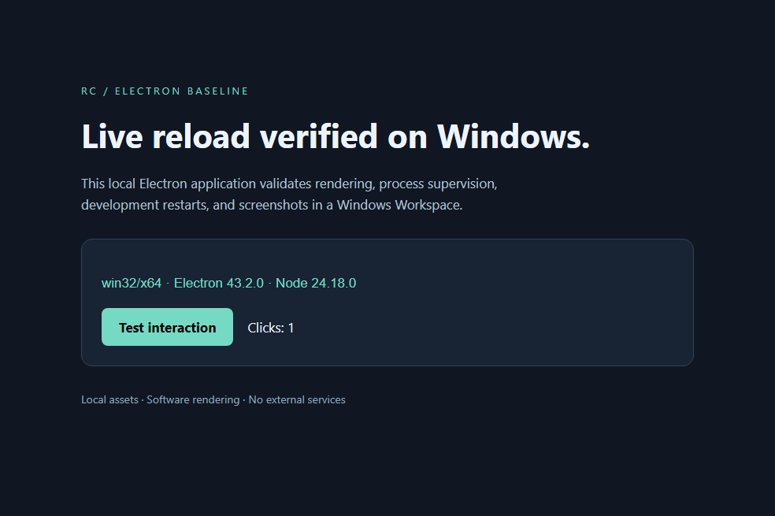
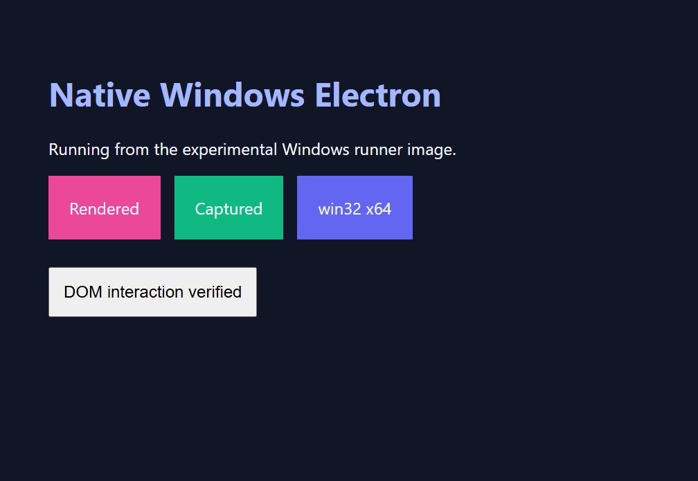

# Native Windows Electron baseline

Date: 2026-09-06. See the [community investigation](windows-gui-community-findings.md).

This report records historical experiment images, which bundled Electron and a
temporary test application. The application has been removed from this repository,
and the current Windows Dockerfile no longer bundles Electron or application
scripts. Image digests and results below describe the historical builds only.

The experiment used a local writable-layer checkout, not Workspace
Repository/Worktree mounts. It does not validate that development flow, which
remains unsupported on Windows. Future application integration fixtures belong
in separate repositories and must exercise the actual mount lifecycle.

A generic Electron 43.2.0 BrowserWindow rendered inside an ordinary Windows
Server Core LTSC 2025 Kubernetes container on Windows build 26100.
Renderer capture through Electron and CDP produced readable pixels.
A programmatic DOM button click also succeeded.

## rc integration validation

The implementation adds Windows Workspace/Environment placement, native paths,
PowerShell lifecycle actions, named-pipe transport, ConPTY, and Job Object
process ownership. The experiment used a temporary Electron development application.
See the [integration guide](../guides/windows-workspaces.md) and
[sample](../../config/samples/workspaces_v1alpha1_workspace_windows.yaml).

Both final Windows image targets built with the repository's native rc binaries:

| Local image tag | Manifest SHA-256 |
| --- | --- |
| `runner-windows:integration-20260906` | `cdb5d186e97688e0113fe5664e414628ac933eba2f25d620fd6bf8f41df94ed5` |
| `openai-codex-cli-windows:integration-20260906` | `e4afb94d658f33e2ffb15769a95bc13a2ca3cfe9a7c2e413445140dff343a773` |

The tag prefix is `test.neko.local/nekomeowww/rc/`. Images were loaded into the
Windows node's containerd store and were not published to a registry.

The ordinary Windows smoke Pod preserved the image entrypoint, mounted a
dedicated static home PVC at `C:\home\agent`, and ran initialization in the
same container as `rc-kube serve`. Its readiness probe succeeded. Requests
through `rc-kube process start` launched `node.exe dev.cjs` and native Codex.
Codex printed version `0.147.0` and exited with code zero.

Editing the generic application's HTML restarted Electron and changed the
captured window. The smoke capture waits for Chromium to present the updated
DOM; otherwise metadata could record a click before the copied frame showed it.
Both Electron capture and the image's CDP helper produced readable pixels.



Stopping the supervised development process returned `Stopped`; a subsequent
process enumeration found no remaining Electron or Node descendants in that
container. This checks rc's process-tree ownership independently of Pod deletion.

After deleting that Pod, a replacement running the final image mounted the same
static Windows home PVC and recreated the local checkout through initialization.
`rc-kube transcript` recovered the previous transcript byte-for-byte. The tested
PVC used a dedicated directory on the Windows node; this is not a validation of
the cluster's dynamic StorageClasses or cross-node portability.

The final image produced this [baseline screenshot](assets/windows-electron/rc-electron-baseline.png).
Its [runtime metadata](assets/windows-electron/rc-electron-runtime.json) records
`win32/x64`, Electron `43.2.0`, a visible BrowserWindow with a native handle, and
the successful DOM click. The capture contains Electron renderer pixels, not
the host desktop or Windows window borders.

The integration smoke namespace, static PV/PVC, and temporary home directory
were removed after validation. The temporary `rc-windows-buildkit` service was
stopped and deleted. Built images and the dedicated build context/cache remain
on the Windows node for reuse.

Native Windows tests passed for Job Object descendant cleanup, ConPTY
start/resize/stop, named-pipe requests, case-insensitive environment overrides,
credential projection/cleanup, and Unicode/failing PowerShell lifecycle actions.
Controller Pod generation and API OS immutability passed envtest/fake-client
tests. `make lint-fix`, `make manifests generate`, `make build-windows`, and the
full `make test` passed. The full test command disabled inherited Git commit
signing for its fixture commits with command-scoped `GIT_CONFIG_*` variables.
The normal Kind e2e suite and a live controller rollout were not run here.

The existing Repository/Worktree mount layout remains Linux-only. The tested
Windows mounted filesystem cannot perform directory renames needed by common
build tools; active source/dependencies use the container's writable layer.
Windows storage-driver provisioning, Environment PVC cloning, and native
desktop input/capture are separate validation requirements.

## Earlier rendering probe



## Why the first Electron launch failed

The instrumented Electron process reached `app.whenReady()` and enumerated a
1024×768 display, but crashed while constructing BrowserWindow. Its minidump
matched the official Electron `43.2.0` Breakpad symbols (module ID
`4F16FF0D8131B7AA4C4C44205044422E1`). The exception address mapped to
`CrashIfExcessiveHandles`; the observed GDI handle count was 10,000. The stack
also included Chromium UI font-selection routines.

Providing the seven standard font files and registering/loading them removed
the failure in a controlled retry. That supports missing system fonts as the
practical cause for this image/application combination. It does not identify
which individual font is the minimum requirement.

The successful launch used ordinary `Start-Process`. Explicitly switching to
`WinSta0\Default` was unnecessary for the verified renderer capture.

## AUV boundary

The AUV Windows driver contains useful capture/input implementations, but the
tested CLI frontend is not wired to them for these commands. Actual output:

```text
auv invoke display.list --json
  display.list is not available on this platform

auv invoke window.capture --title "Windows Electron container probe" --json
  window.capture is only available on macOS
```

The inspected `auv-cli-invoke/src/commands/display.rs` gates `observe_displays`
to Linux/macOS. Therefore Windows driver source support must not be confused
with working Windows CLI commands. AUV integration needs a frontend route or
driver harness, and native capture fidelity still requires testing.

## Native Windows image build

The [experimental Dockerfile](../../images/runner-windows/Dockerfile)
has a `runner` target and a derived `codex` target. It consumes offline staged
Windows assets rather than requiring build-container internet access.

| Component | Tested version |
| --- | --- |
| Node | 26.8.1 |
| Electron | 43.2.0 |
| Git | 2.51.0.windows.2 |
| Codex CLI | 0.147.0 |
| pnpm | 10.26.2 |
| Bun | 1.4.0 |
| BuildKit | 0.33.0 |

The Windows node uses containerd. Builds therefore used native Windows
`buildctl` and image export/import into containerd's `k8s.io` namespace;
the Mac's Linux Docker runtime cannot run these Windows images.

BuildKit's HostProcess failure exactly matched
[moby/buildkit #6590](https://github.com/moby/buildkit/issues/6590). Its documented
workaround is a native Windows service outside the HostProcess silo. The
experiment created the manual-start service `rc-electron-buildkit`, a dedicated
named pipe, state under `C:\rc-electron-experiment`, and containerd namespace
`rc-electron-experiment`. Existing cluster services and CNI settings were not
changed.

The runner image built as:

```text
test.neko.local/nekomeowww/rc/runner-windows:experiment-20260906
sha256:c92d76dd64a9590ba926fc4999b0f87a26f127d752e2f7ccbac8b59bb53e2deb
```

The derived Codex image built as:

```text
test.neko.local/nekomeowww/rc/openai-codex-cli-windows:experiment-20260906
sha256:d4e28738e6109191fbac63aabb076ee6f6d30e6d2477eca8736b72648205fd8c
```

The Codex build executed all three pinned CLI version checks successfully.
Neither image was pushed to a registry. Both were imported and unpacked in
containerd's `k8s.io` namespace.

A fresh ordinary pod using the runner image created Electron and produced a
[readable screenshot](assets/windows-electron/runner-image-electron.png) without
host fonts or tool directories mounted into it. A second screenshot through
the [CDP helper](assets/windows-electron/runner-image-cdp.png) also succeeded.
[Runtime metadata](assets/windows-electron/runner-image-probe.json) records
Electron `43.2.0`, `win32/x64`, its native window handle, and display bounds.

The probe's four Electron processes were visible on the host in container
session 5. After deleting the pod, none remained. This verifies container
process cleanup for the tested application tree, including a supervising
PowerShell process waiting for Electron.
